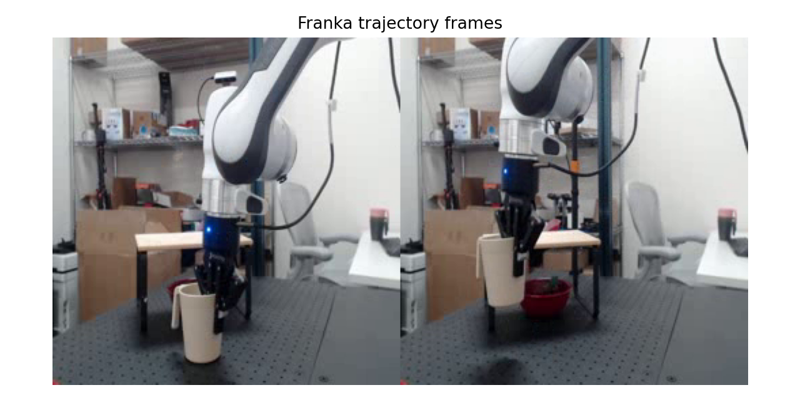
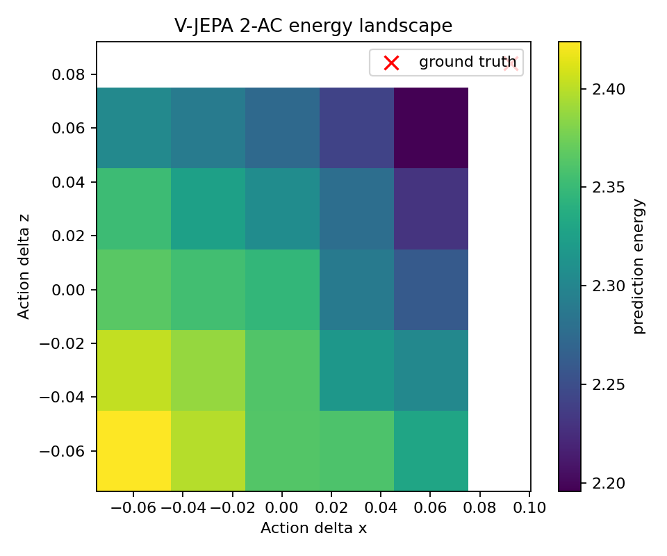

# V-JEPA 2-AC Franka Demo

本文说明如何跑通当前 repo 里的 V-JEPA 2-AC Franka 机器人 demo，并解释输出图片和终端结果。

## 这个 Demo 是什么

V-JEPA 2-AC 是一个 **action-conditioned latent world model**。它不是直接预测机器人动作的 policy，而是预测“执行某个候选动作后，视觉 latent 会变成什么样”。

核心流程：

```text
当前图像 -> encoder -> 当前 latent
目标图像 -> encoder -> 目标 latent
候选动作 + 当前机器人状态 + 当前 latent -> predictor -> 预测下一帧 latent
预测 latent 和目标 latent 越接近，该动作 energy 越低
```

所以 demo 做的是：对候选机器人动作打分，并用 CEM/MPC 搜索低 energy 动作。

注意：这不是真实 Franka 闭环控制，也不是仿真 rollout。它是离线轨迹上的 world-model planning 示例。

## 相关文件

- 脚本：[notebooks/franka_robot_demo.py](../notebooks/franka_robot_demo.py)
- 原始 notebook：[notebooks/energy_landscape_example.ipynb](../notebooks/energy_landscape_example.ipynb)
- 示例轨迹：[notebooks/franka_example_traj.npz](../notebooks/franka_example_traj.npz)
- CEM 工具：[notebooks/utils/mpc_utils.py](../notebooks/utils/mpc_utils.py)
- World model wrapper：[notebooks/utils/world_model_wrapper.py](../notebooks/utils/world_model_wrapper.py)

示例轨迹只有两帧：

```text
observations: (1, 2, 256, 256, 3)
states:       (1, 2, 7)
```

其中 7D state/action 是：

```text
x, y, z, roll, pitch, yaw, gripper
```

## 环境

使用 uv 创建环境：

```bash
cd /home/yunlong/workspace/vjepa2

UV_CACHE_DIR=/home/yunlong/workspace/vjepa2/.uv-cache \
  uv venv --python /usr/bin/python3 --system-site-packages .venv
```

安装 demo 依赖：

```bash
UV_CACHE_DIR=/home/yunlong/workspace/vjepa2/.uv-cache \
  uv pip install --python .venv/bin/python -e . --no-deps

UV_CACHE_DIR=/home/yunlong/workspace/vjepa2/.uv-cache \
  uv pip install --python .venv/bin/python einops matplotlib decord scipy tqdm opencv-python
```

这里使用 `--system-site-packages` 是为了复用系统里已有的 CUDA PyTorch，避免重复下载大体积 PyTorch 包。

## Checkpoint

需要下载 V-JEPA 2-AC checkpoint：

```text
https://dl.fbaipublicfiles.com/vjepa2/vjepa2-ac-vitg.pt
```

放到：

```text
checkpoints/vjepa2-ac-vitg.pt
```

文件大小应为：

```text
11760743310 bytes
```

检查：

```bash
stat -c '%s bytes' checkpoints/vjepa2-ac-vitg.pt
```

## 运行 Demo

基础运行：

```bash
.venv/bin/python -m notebooks.franka_robot_demo \
  --checkpoint checkpoints/vjepa2-ac-vitg.pt \
  --trajectory notebooks/franka_example_traj.npz
```

生成可视化：

```bash
.venv/bin/python -m notebooks.franka_robot_demo \
  --checkpoint checkpoints/vjepa2-ac-vitg.pt \
  --trajectory notebooks/franka_example_traj.npz \
  --save-viz outputs/franka_demo
```

快速检查，不跑 CEM：

```bash
.venv/bin/python -m notebooks.franka_robot_demo \
  --checkpoint checkpoints/vjepa2-ac-vitg.pt \
  --trajectory notebooks/franka_example_traj.npz \
  --save-viz outputs/franka_demo \
  --skip-cem
```

## 输出 1：轨迹帧可视化

生成路径：

```text
outputs/franka_demo/trajectory_frames.png
```

文档示例图：



解释：

- 这张图把 `franka_example_traj.npz` 里的两帧 RGB 观测拼在一起。
- 左右两帧可以理解为“当前状态”和“目标状态”。
- 它用于确认 demo 读取的视觉输入是否正确。
- 因为样例只有两帧，所以它不是完整机器人动作视频，只是一个 before/after 状态对。

## 输出 2：Energy Landscape

生成路径：

```text
outputs/franka_demo/energy_landscape.png
```

文档示例图：



解释：

- 横轴是候选动作的 `delta x`。
- 纵轴是候选动作的 `delta z`。
- 颜色是 prediction energy：预测下一帧 latent 与目标帧 latent 的距离。
- energy 越低，说明模型认为该动作越可能把当前视觉状态推向目标视觉状态。
- 红色 `x` 是由示例轨迹两帧 robot state 计算出的 ground-truth action。

默认网格参数：

```text
--energy-nsamples 5
--energy-grid-size 0.075
```

也就是在 `dx/dy/dz` 三个方向各采 5 个值，共评估 `5 * 5 * 5 = 125` 个候选动作。图中只显示 `x/z` 两个维度，`y` 维度被折叠进二维热力图。

## 终端输出怎么看

成功加载 checkpoint：

```text
Loaded weights: encoder missing/unexpected=0/0; predictor missing/unexpected=0/0
```

含义：encoder 和 action-conditioned predictor 的权重都正确加载。

轨迹输入：

```text
Loaded trajectory: clips=(1, 3, 2, 256, 256); states=(1, 2, 7); ...
```

含义：

- `clips` 是模型输入视频，格式为 `(batch, channels, frames, height, width)`。
- `states` 是机器人状态，格式为 `(batch, frames, 7)`。

One-step prediction：

```text
One-step inference: repr=(1, 512, 1408); pred_next=(1, 256, 1408); energy=[...]
```

含义：

- `repr=(1, 512, 1408)` 是两帧图像的 latent tokens。
- 每帧有 `16 * 16 = 256` 个 patch token，两帧共 512 个 token。
- `pred_next=(1, 256, 1408)` 是模型根据当前 latent 和 action 预测出的下一帧 latent。
- `energy` 是预测 latent 和目标 latent 的平均 L1 距离。它不是成功率，只用于比较动作优劣。

CEM planning：

```text
CEM planning: planned_shape=(2, 7); first_action_xyz_grip=[...]
```

含义：

- CEM 返回了长度为 2 的 action rollout。
- 每个 action 是 7D：`dx, dy, dz, droll, dpitch, dyaw, dgripper`。
- 打印的 `first_action_xyz_grip` 是第一个动作的 `dx, dy, dz, dgripper` 摘要。

## 算法简述

1. 用 V-JEPA encoder 编码当前帧和目标帧。
2. 从两帧 robot state 计算 ground-truth action。
3. 用 predictor 预测执行候选 action 后的下一帧 latent。
4. 计算 `energy = mean(abs(predicted_next_latent - goal_latent))`。
5. 对 action 网格画出 energy landscape。
6. 用 CEM 采样动作、保留低 energy 动作、更新分布，得到规划动作。

## CEM 如何和 V-JEPA 2-AC 结合

CEM，全称 Cross-Entropy Method，是一种采样式优化方法。它不需要训练新的 policy，而是在动作空间里反复采样、打分、筛选，逐步把采样分布移动到更优动作附近。

在这个 demo 中，V-JEPA 2-AC 提供“动作评分函数”，CEM 负责“搜索动作”：

```text
CEM 采样候选 action
  -> V-JEPA 2-AC predictor 预测 action 后的下一帧 latent
  -> 与 goal latent 计算 energy
  -> CEM 选出 energy 最低的 top-k action
  -> 更新下一轮采样分布
  -> 返回低 energy action
```

更具体地说：

1. V-JEPA encoder 先把当前图像编码成 `z_t`，把目标图像编码成 `z_goal`。
2. CEM 随机采样一批候选动作序列，例如 `(samples, rollout, 7)`。
3. 对每个候选动作，V-JEPA 2-AC predictor 预测执行后的 latent：`z_hat_{t+1}`。
4. 用 `mean(abs(z_hat_{t+1} - z_goal))` 作为该动作的 energy。
5. CEM 保留 energy 最低的 `topk` 个动作。
6. 用这些低 energy 动作更新采样均值和方差。
7. 重复若干轮后，输出当前分布的平均动作作为规划结果。

所以 V-JEPA 2-AC 在这里不是直接“吐出动作”，而是回答一个问题：

```text
如果执行这个 action，视觉世界会不会更接近目标？
```

CEM 再利用这个回答，在连续动作空间中搜索一个更可能到达目标的动作。

脚本中的关键参数：

- `--cem-samples`：每轮采样多少个候选动作。
- `--cem-steps`：更新采样分布多少轮。
- `--cem-topk`：每轮保留多少个低 energy 动作。

更大的 CEM 参数会更慢，但搜索更充分：

```bash
.venv/bin/python -m notebooks.franka_robot_demo \
  --checkpoint checkpoints/vjepa2-ac-vitg.pt \
  --trajectory notebooks/franka_example_traj.npz \
  --save-viz outputs/franka_demo \
  --cem-samples 100 \
  --cem-steps 10 \
  --cem-topk 10
```

## 排障

checkpoint 缺失：

```bash
ls -lh checkpoints/vjepa2-ac-vitg.pt
```

显存不足：

```bash
.venv/bin/python -m notebooks.franka_robot_demo \
  --checkpoint checkpoints/vjepa2-ac-vitg.pt \
  --trajectory notebooks/franka_example_traj.npz \
  --skip-cem
```

或者减小：

```text
--cem-samples
--cem-steps
--energy-nsamples
```

依赖缺失时，确认使用的是 `.venv/bin/python`：

```bash
.venv/bin/python -m notebooks.franka_robot_demo --help
```

## 跑通 Checklist

1. `.venv` 存在。
2. `checkpoints/vjepa2-ac-vitg.pt` 存在，大小是 `11760743310 bytes`。
3. 终端出现 `Loaded weights: encoder missing/unexpected=0/0; predictor missing/unexpected=0/0`。
4. 终端出现 `One-step inference`。
5. `--save-viz` 后生成 `trajectory_frames.png` 和 `energy_landscape.png`。
6. 不加 `--skip-cem` 时，终端出现 `CEM planning`。
